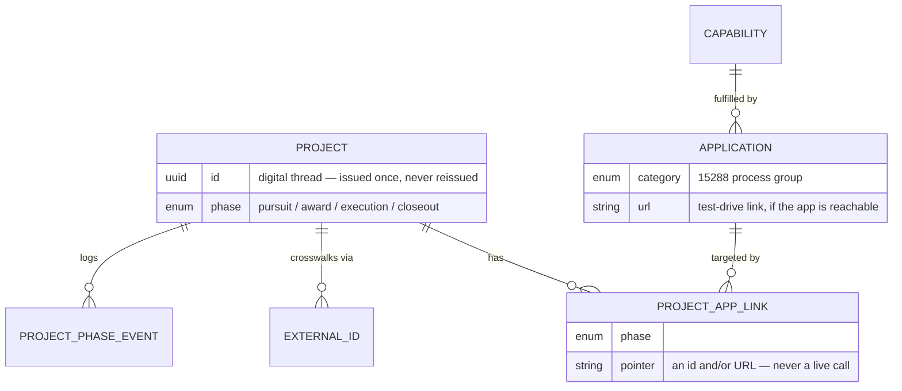

# Conway's Depot

An **app store for projects** — a registry, not a platform, for tracking the domain
applications an organization builds, plans, or buys (value-stream mapping, capture,
contract authoring, staffing, …) and the projects that connect to them, tied together by one
persistent id per project (its "digital thread") instead of a shared database or a live API
mesh.

Read the app's own [About](#) page (`/about` once running) for the reasoning. The short
version: a catalog of the tools an org builds or buys, each mapped to the business capability it
serves and the team that owns it. The framing borrows from
well-worn practice — internal developer portals / software catalogs, capability maps, and the
systems-engineering "digital thread" — not invented vocabulary.

## What it holds



One project connects to many applications; each connection is its own row (`ProjectAppLink`)
carrying a phase and a pointer, so the same app can be linked at more than one phase and an
app that isn't built yet can be linked before it exists.

- **Project** — one id, a name, a customer, and a `phase` (Pursuit → Award → Execution →
  Closeout). Accumulates `ExternalId` crosswalk entries (a WinMax opportunity number, a
  Costpoint charge number) as it moves through real systems — the Depot's own id never gets
  replaced by one of them.
- **Application** — a catalog entry: a `category` (a 15288 process group — its browse aisle),
  the `Capability` it fills, an owning team, and a `url` if it's a real running app you can
  test-drive. Vendor products and not-yet-built tools have no url; the description says which.
- **Capability** — the stable business need (TOGAF-style) an Application currently fulfills.
  Swap the application later; the capability and every project's history stay put.
- **ProjectAppLink** — the only "integration" the Depot performs: a plain pointer (an id
  and/or URL) saying this project has a record in this application, at this phase. Never a
  live API call.

## Two altitudes, one app

The project list and the Application Registry are the **portfolio view** — every project and
the whole catalog at once. A project's detail page (`/projects/:id`) is that project's **home
base**: the digital thread, its connected applications, the `ExternalId` crosswalk, phase
history, and `team_notes` / `channels` for the team working it. A PM drills into a project; an
architect stays at the list. (This absorbed a separate "Launchpad" app — same records, one
fewer deploy.)

## Viewing as (a demo lens, not auth)

The nav has a persona switcher next to ⚙ Admin. It is **not** authentication — there is no
password, session, or permission check anywhere behind it (`models.Person`). It exists to
illustrate the "in production a user is on a few projects, not all of them" shape: pick a
persona and the project list and Application Registry default to that person's work, with an
"All" toggle that hides nothing you couldn't reach by URL anyway. The default persona is
literally **Admin** (an "Enterprise Architect" see-everything seat); the switcher lets you view
as one of the other people instead. There's no Admin nav link — the `/admin` management view is
still reachable by URL and via the demo shell's black bar; it was never access-controlled. Real
identity/access is in the catalog as the (unbuilt) **People & Access Directory** app, capability
*Identity & Project Membership*.

## Stack

Same conventions as the sibling apps (Value Stream, BurnedValue): Flask + SQLAlchemy + SQLite
backend, React + TypeScript + Vite frontend, AI chat assist optional and off by default
(`AI_PROVIDER=none`).

## Running locally

```bash
# Backend (port 8090)
cd backend
python3 -m venv .venv && source .venv/bin/activate
pip install -r requirements-dev.txt
python app.py

# Frontend (port 5175), separate terminal
cd frontend
npm install
npm run dev
```

Visit `http://localhost:5175`. The database seeds itself on first run: the Application catalog
comes seeded with a real sibling app (Value Stream, has a url), vendor products (WinMax,
Contract & Legal Authoring), and two tools that aren't built yet (Staffing & Capacity Engine,
People & Access Directory — their descriptions say so). One demo project ties them together —
its Execution-phase link points at Value Stream's own real seeded demo map, so it's a
genuine clickable connection between two independently-running apps, not a mockup (only works
if Value Stream's dev server is also running on `:5173`). A handful of demo **personas** are
seeded separately (see "Viewing as" above).

Set `AI_PROVIDER=claude|gemini|ollama` (plus `AI_API_KEY`/`AI_MODEL` as needed) to enable the
chat assistant. Every insight it can give you — capability gaps, team-ownership load — is
computed deterministically first; the AI's job is to explain what the registry already proves,
never to invent data.

## Explicitly not here yet

No live integration with WinMax, Costpoint, or anything else. No staffing/capacity math — that
capability is in the catalog as an unbuilt entry on purpose, because it's a real, hard problem
that deserves its own project. No auth, no permissions, no enforcement — the persona switcher is a
view lens, not a security boundary (every persona can still reach every page by URL). This is
scaffolding sized to prove the shape is right before anything heavier gets built on it.
